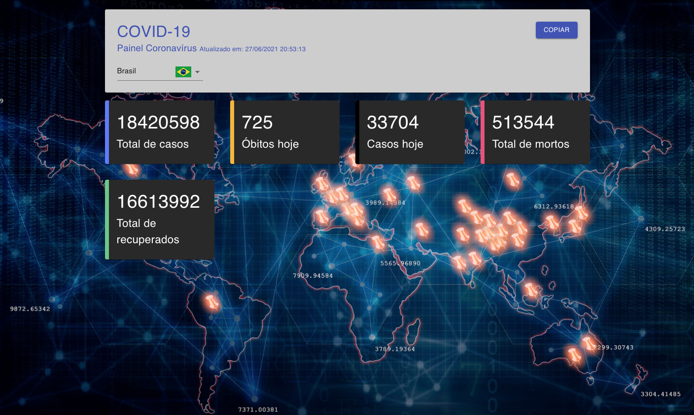

<h4 align="center">
  This React app consists of bringing the daily data of covid19 of each country consuming an api
</h4>
<br>


<br>
<br>

<p align="center">


</p> 

<p align="center">
  <a href="#rocket-built-with">Built with</a>&nbsp;&nbsp;&nbsp;|&nbsp;&nbsp;&nbsp;
  <a href="#information_source-how-to-run">How to run</a>
</p>
<br><br>

##  Built with

This project was developed with the following technologies:

-  [Node.js](https://nodejs.org/)
-  [React](https://reactjs.org/)
-  [VS Code](https://code.visualstudio.com/)

## information_source: How to run

### Requirements
To run the app, you will need [Git](https://git-scm.com), [Node.js](https://nodejs.org/) v12.13.1 or higher, [Npm](https://www.npmjs.com/), [React](https://reactjs.org/)
<br>

### Application
Now clone the repository and install the dependencies.
```bash
# to clone the repository
git clone https://github.com/Mopanc/covid19-tracker.git

# go into the folder
cd covid19-tracker/

#install the backend dependencies
npm install

```

# run application
```bash
npm run start
```

<br>
<br>
<hr>
<br><br>


The credits of this project belong to [Bruno Carneiro](https://github.com/Tautorn) and [Digital Innovation One](https://web.digitalinnovation.one/) and [SPtech](http://www.sptech-ind.com.br/) because without them it wouldn't have been possible!


